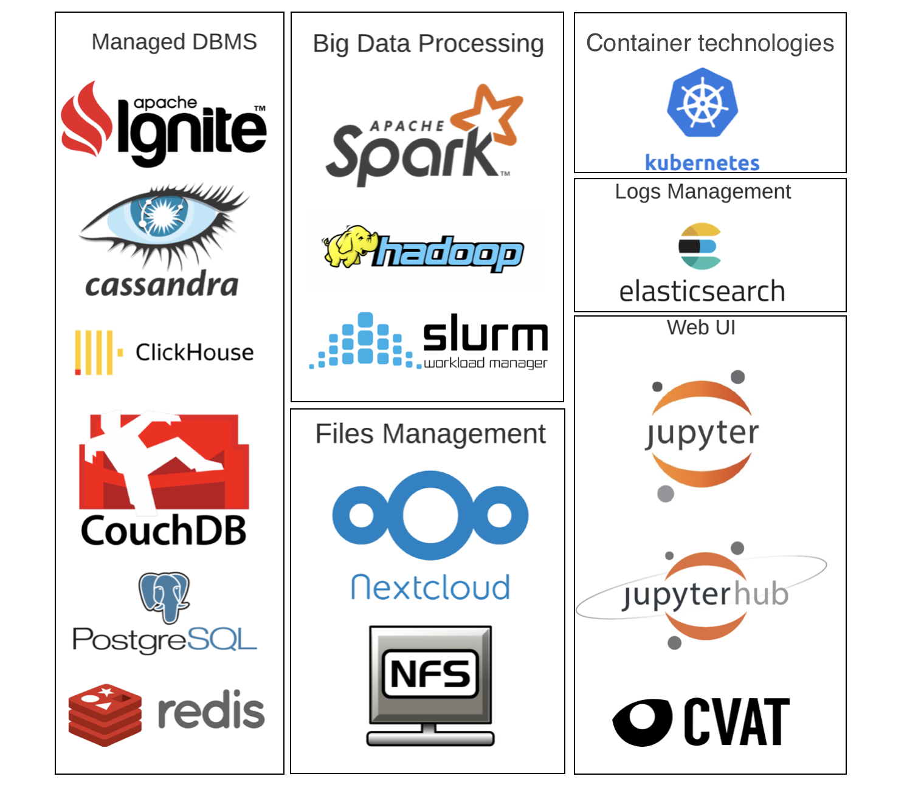

.. _michman_services_section:

.. _Ignite: https://ignite.apache.org

.. _Cassandra: https://cassandra.apache.org

.. _ClickHouse: https://clickhouse.tech

.. _CouchDB: https://couchdb.apache.org

.. _PostgreSQL: https://www.postgresql.org

.. _Redis: https://redis.io

.. _Spark: https://spark.apache.org

.. _Hadoop: https://hadoop.apache.org

.. _YARN: https://spark.apache.org/docs/latest/running-on-yarn.html

.. _JupyterLab: https://jupyter.org

.. _JupyterHub: https://jupyterhub.readthedocs.io/en/stable/

.. _Nextcloud: https://nextcloud.com

.. _Elasticsearch: https://www.elastic.co

.. _Kubernetes: https://kubernetes.io

.. _Slurm: https://slurm.schedmd.com/documentation.html

.. _MariaDB: https://mariadb.org/

Supported Services
==================

This section gives information about services that can be deployed using Michman.

Managed DBMS
-------------

Michman supports a set of different databases, that could be easy deployed in the cloud.

**Apache Ignite**

Apache `Ignite`_ is a Distributed Database for high-performance computing with in-memory speed. It could be deployed in the distributed cluster of virtual machines in the cloud with Michman. 

For now we support *7.1.1* Apache Ignite version. 

Config parameter for **ignite** service type supports:

* **memory** -- percentage (integer number from 0 to 100) of worker memory to be assigned to Apache Ignite.
                       Currently this simply reduces spark executor memory, Apache Ignite memory usage must be manually configured.

Following example shows request to create 3-nodes cluster with Apache Ignite with specified memory parameter.

.. parsed-literal::
	curl http://michman_addr:michman_port/projects/{ProjectID}/clusters -XPOST -d 
	'{
		"DisplayName": "my-cluster",
		"Services": [
			{
				"Name": "ignite-service",
				"Type": "ignite",
				"Version": "7.1.1",
				"Configs": {
					"memory": "30"
				}

			}
		],
		"Image": "ubuntu",
		"NHosts": 3
	}'

Full and actual information about supported Apache Ignite configurations and versions you can get via following url:

.. parsed-literal::
	curl http://michman_addr:michman_port/configs/ignite

**Apache Cassandra**

Apache `Cassandra`_ is a free and open-source, distributed, wide column store, NoSQL database management system designed to handle large amounts of data across many commodity servers, providing high availability with no single point of failure. It could be deployed in the distributed cluster of virtual machines in the cloud with Michman. 

We can deploy Apache Cassandra connected to Spark.

For now we support *3.11.4* Apache Cassandra version. 

Following example shows request to create 3-nodes cluster with Apache Cassandra and Spark.

.. parsed-literal::
	curl http://michman_addr:michman_port/projects/{ProjectID}/clusters -XPOST -d 
	'{
		"DisplayName": "my-cluster",
		"Services": [
			{
				"Name": "cassandra-service",
				"Type": "cassandra",
				"Version": "3.11.4"
			},
			{
				"Name": "spark-service",
				"Type": "spark",
				"Version": "2.3.0",
			}
		],
		"Image": "ubuntu",
		"NHosts": 3
	}'

Full and actual information about supported Apache Cassandra configurations and versions you can get via following url:

.. parsed-literal::
	curl http://michman_addr:michman_port/configs/cassandra

**ClickHouse**

`ClickHouse`_ is a fast open-source OLAP database management system. It could be deployed in the storage node in the cloud with Michman. 

For now we support the *latest* ClickHouse version. 

Config parameter for **clickhouse** service type supports:

* **db_password** -- Default user password for Clickhouse DB for user 'default', you can change it.

Following example shows request to get the ClichHouse DBMS in the cloud.

.. parsed-literal::
	curl http://michman_addr:michman_port/projects/{ProjectID}/clusters -XPOST -d 
	'{
		"DisplayName": "my-cluster",
		"Services": [
			{
				"Name": "clickhouse-service",
				"Type": "clickhouse",
				"Configs": {
					"db_password": "secret"
				}
			}
		],
		"Image": "ubuntu",
		"NHosts": 1
	}'

Full and actual information about supported ClickHouse configurations and versions you can get via following url:

.. parsed-literal::
	curl http://michman_addr:michman_port/configs/clickhouse

**Apache CouchDB**

Apache `CouchDB`_ is an open-source document-oriented NoSQL database, implemented in Erlang. It could be deployed in the storage node in the cloud with Michman. 

For now we support the *latest* CouchDB version. 

Config parameter for **couchdb** service type supports:

* **db_password** -- Default user password for CouchDB for user 'admin', you can change it.

Following example shows request to get the CouchDB DBMS in the cloud.

.. parsed-literal::
	curl http://michman_addr:michman_port/projects/{ProjectID}/clusters -XPOST -d 
	'{
		"DisplayName": "my-cluster",
		"Services": [
			{
				"Name": "couchdb-service",
				"Type": "couchdb",
				"Configs": {
					"db_password": "secret"
				}
			}
		],
		"Image": "ubuntu",
		"NHosts": 1
	}'

Full and actual information about supported CouchDB configurations and versions you can get via following url:

.. parsed-literal::
	curl http://michman_addr:michman_port/configs/couchdb

**MariaDB**

`MariaDB`_ - is a free and open-source relational database. It can be deployed as a cloud storage with the help of orchestration system Michman.
Config parameter for **MariaDB** service type supports:

* **db_password** -- password for database. Default meaning: password.
* **db_user** -- user for database. Default meaning: user. 

Following example shows request to get the MariaDB in the cloud.

.. parsed-literal::
	curl http://michman_addr:michman_port/projects/{ProjectID}/clusters -XPOST -d 
	'{
		"DisplayName": "test",
		"Services": [
			{
				"Name": "mariadb",
				"Type": "mariadb",
				"Config": {
					"db_password": "secret"
				}
			}
		],
		"Image": "ubuntu21.04",
		"NHosts": 1
	}'

Full and actual information about supported MariaDB configurations and versions you can get via following url:

.. parsed-literal::
	curl http://michman_addr:michman_port/configs/mariadb

**PostgreSQl**

`PostgreSQL`_ is a free and open-source relational database management system (RDBMS) emphasizing extensibility and SQL compliance. It could be deployed in the storage node in the cloud with Michman. 

For now we support the *9.6*, *10*, *11* and *12* PostgreSQL versions. 

Config parameter for **postgresql** service type supports:

* **db_password** -- Default user password for PostgreSQL DB for user postgres, you can change it.

Following example shows request to get the PostgreSQl DBMS in the cloud.

.. parsed-literal::
	curl http://michman_addr:michman_port/projects/{ProjectID}/clusters -XPOST -d 
	'{
		"DisplayName": "my-cluster",
		"Services": [
			{
				"Name": "postgresql-service",
				"Type": "postgresql",
				"Configs": {
					"db_password": "secret"
				}
			}
		],
		"Image": "ubuntu",
		"NHosts": 1
	}'

Full and actual information about supported PostgreSQl configurations and versions you can get via following url:

.. parsed-literal::
	curl http://michman_addr:michman_port/configs/postgresql

**Redis**

`Redis`_ is an open source (BSD licensed), in-memory data structure store, used as a database, cache, and message broker. It could be deployed in the storage node in the cloud with Michman. 

For now we support the *latest* Redis version. 

Config parameter for **redis** service type supports:

* **db_password** -- Default user password for Redis, you can change it. User name is not required.

Following example shows request to get the Redis DBMS in the cloud.

.. parsed-literal::
	curl http://michman_addr:michman_port/projects/{ProjectID}/clusters -XPOST -d 
	'{
		"DisplayName": "my-cluster",
		"Services": [
			{
				"Name": "redis-service",
				"Type": "redis",
				"Configs": {
					"db_password": "secret"
				}
			}
		],
		"Image": "ubuntu",
		"NHosts": 1
	}'

Full and actual information about supported Redis configurations and versions you can get via following url:

.. parsed-literal::
	curl http://michman_addr:michman_port/configs/redis

Big Data Processing
--------------------

For complex computational tasks and problems with big data processing could be used such applications as Apache Spark and Apache Hadoop.

**Apache Spark and Apache Hadoop** 

Apache `Spark`_ is a unified analytics engine for big data processing, with built-in modules for streaming, SQL, machine learning and graph processing.  It could be deployed in the distributed cluster of virtual machines in the cloud with Michman. 

The Apache `Hadoop`_ software library is a framework that allows for the distributed processing of large data sets across clusters of computers using simple programming models. It is designed to scale up from single servers to thousands of machines, each offering local computation and storage.

Michman runs Spark connected to Hadoop and supports different Spark plugins: Jupyter, Jupyterhub, Cassandra. Also, it may be launched with `YARN`_ Resource Manager.

For now we support following Spark versions: *1.0.0*, *1.0.1*, *1.0.2*, *1.1.0*, *1.1.1*, *1.2.0*, *1.2.1*, *1.2.2*, *1.3.0*, *1.3.1*, *1.4.0*, *1.4.1*, *1.5.0*, *1.5.1*, *1.5.2*, *1.6.0*, *1.6.1*, *1.6.2*, *2.0.0*, *2.0.1*, *2.0.2*, *2.1.0*, *2.2.0*, *2.2.1*, *2.3.0*.

Config parameter for **spark** service type supports:

* **use-yarn** -- Spark-on-YARN deploy mode  (has overhead on memory so do not use it if you don't know why)
* **hadoop-version** -- use specific Hadoop version for Spark. Default is the latest supported in Spark.
* **spark-worker-mem-mb** --  don't auto-detect spark worker memory and use specified value, can be useful if other
                             processes on slave nodes (e.g. python) need more memory, default for 10Gb-20Gb RAM slaves is to leave 2Gb to
                             system/other processes; 
* **yarn-master-mem-mb** -- Amount of physical memory, in MB, that can be allocated for containers. Default value if 10240.
      
Following example shows request to create 3-nodes cluster with Apache Spark on YARN.

.. parsed-literal::
	curl http://michman_addr:michman_port/projects/{ProjectID}/clusters -XPOST -d 
	'{
		"DisplayName": "my-cluster",
		"Services": [
			{
				"Name": "spark-service",
				"Type": "spark",
				"Version": "2.3.0",
				"Configs": {
					"use-yarn": "true"
				}
			}
		],
		"Image": "ubuntu",
		"NHosts": 3
	}'

Full and actual information about supported Apache Spark configurations and versions you can get via following url:

.. parsed-literal::
	curl http://michman_addr:michman_port/configs/spark

**Slurm**

`Slurm`_ is an open source, and highly scalable cluster management and job scheduling system for large and small Linux clusters. The job scheduling system can be deployed in the cluster of virtual machines in the cloud with the help of orchestration system Michman. At the moment Slurm can be deployed on operating system Ubuntu. Two versions of slurm are supported now, which depends on image of OS. If image is ubuntu18.04, the version is slurm-wlm 17.11.2, ubuntu21.04 - slurm-wlm 20.11.4. Also there are four versions of deploying Slurm: Slurm - version of service without any additional services, Slurm-db -version with an accounting system, Slurm-nfs - version with shared file system, Slurm-db-nfs - version of service with shared file system and with an accounting system. REST API interface for Slurm is provided too.

Config parameter for **Slurm** service type supports: 

* **use_rest** -- parameter for setting or not Slurm REST API. Parameter value can become true, if selected version of Slurm is Slurm-db and OS Image is == Ubuntu21.04. Defaault value: false. For correct working Slurm REST API user must export shell variable SLURM_JWT, that has been already generated, on the host from which the request will be sent. For these purposes user has to login to master-host, copy content of the file /var/log/slurm/slurm_token to terminal (execute SLURM_JWT= ...). Variables X-SLURM-USER-NAME and X-SLURM-USER-TOKEN must be mentioned in the request, which values are fixed: X-SLURM-USER-NAME:root and X-SLURM-USER-TOKEN:${SLURM_JWT}. 

	Example of the request: 
	
	.. parsed-literal::
		curl -H "X-SLURM-USER-NAME:root" -H "X-SLURM-USER-TOKEN:${SLURM_JWT}" http://{IP-адрес master-хоста}:6820/slurm/v0.0.36/ping
	
	Examples of requests are located here: https://app.swaggerhub.com/apis/rherrick/slurm-rest_api/0.0.35.

* **db_password** -- password for database. This parameter is available, if selected version of Slurm is Slurm-db. Default value: slurmdbd
* **db_user** -- user for database. This parameter is available, if selected version of Slurm is Slurm-db. Default value: slurm
* **TaskPluginParam** -- parameter of configuration file slurm.conf. The parameter is used for TaskPlugin, that identifies the type of task launch plugin, typically used to provide resource management within a node. Allowable values: None, Boards, Sockets, Cores, Threads, and/or Verbose. Multiple options should be comma separated. Default value: None.
* **use_open_foam** -- parameter for using or not OpenFOAM with Slurm. 
* **config_dir** -- path to template of configuration file slurm.conf.
* **cgroup_config_dir** -- path to template of configuration file cgroup.conf.
* **use_open_mpi** -- parameter for using or not OpenMPI with Slurm. 
* **partitions** -- list that describes partitions of Slurm-cluster. These configuratios are located in slurm.conf. The list consists of strings, where argumants are separated with the help of :. First argument is name of partition, second one - amount of hosts, related to the partition. Partition witn name \"main\" must be in every users' request, as the partition is going to be default. Example of list from users' request: \"main:5\", \"part_1:2\", \"part_2:3\", \"part_3:4\"
* **open_mpi_version** -- version of OpenMPI.
Following example shows request to create 2-nodes cluster with Slurm service, including accounting system and REST API interface.

.. parsed-literal::
	curl http://michman_addr:michman_port/projects/{ProjectID}/clusters -XPOST -d 
 	'{
		"DisplayName":"test", 
		"Services":[{
			"Name":"Slurm service",
			"Type":"slurm",
			"Version": "Slurm-db",
			"Config":{
				"use_rest": "true"
			}
		}], 
		"Description": "cluster", 
		"Image": "ubuntu21.04", 
		"NHosts": 2
	}'

Full and actual information about supported Slurm configurations and versions you can get via following url:

.. parsed-literal::
	curl http://michman_addr:michman_port/configs/slurm

Web UI
-------

With Michman you can easy deploy the most populars web-based laboratories for interactive development: Jupyter and Jupyterhub.

**Jupyter**

JupyterLab is a web-based interactive development environment for Jupyter notebooks, code, and data. JupyterLab is flexible: configure and arrange the user interface to support a wide range of workflows in data science, scientific computing, and machine learning. It could be deployed in the master node in the cloud with Michman. 

For now we support the *6.0.1* Jupyter version. It also could be deployed with Spark-connector plugin.

Following example shows request to create 3-nodes cluster with Jupyter service.

.. parsed-literal::
	curl http://michman_addr:michman_port/projects/{ProjectID}/clusters -XPOST -d 
	'{
		"DisplayName": "my-cluster",
		"Services": [
			{
				"Name": "jupyter-service",
				"Type": "jupyter"
			}
		],
		"Image": "ubuntu",
		"NHosts": 3
	}'

Full and actual information about supported Jupyter configurations and versions you can get via following url:

.. parsed-literal::
	curl http://michman_addr:michman_port/configs/jupyter

**JupyterHub**

`JupyterHub`_ brings the power of notebooks to groups of users. It gives users access to computational environments and resources without burdening the users with installation and maintenance tasks. Users - including students, researchers, and data scientists - can get their work done in their own workspaces on shared resources which can be managed efficiently by system administrators.

For now we support the *1.3.0* Jupyterhub version. It also could be deployed with Spark-connector plugin.

Following example shows request to create 3-nodes cluster with JupyterHub service.

.. parsed-literal::
	curl http://michman_addr:michman_port/projects/{ProjectID}/clusters -XPOST -d 
	'{
		"DisplayName": "my-cluster",
		"Services": [
			{
				"Name": "jupyterhub-service",
				"Type": "jupyterhub"
			}
		],
		"Image": "ubuntu",
		"NHosts": 3
	}'

Full and actual information about supported JupyterHub configurations and versions you can get via following url:

.. parsed-literal::
	curl http://michman_addr:michman_port/configs/jupyterhub

Files Management
-----------------

Michman provides services to easy work with data in the cloud.

**NextCloud**

`Nextcloud`_ is a suite of client-server software for creating and using file hosting services. Nextcloud is free and open-source, which means that anyone is allowed to install and operate it on their own private server devices. It could be deployed in the storage node in the cloud with Michman. 

Config parameter for **nextcloud** service type supports:

* **weblab_name** -- name of Web Laboratory.
* **nfs_server_ip** -- NFS server IP.
* **mariadb_image** -- your docker image with mariadb
* **nextcloud_image** -- your docker image with nextcloud

Following example shows request to create 3-nodes cluster with Nextcloud service.

.. parsed-literal::
	curl http://michman_addr:michman_port/projects/{ProjectID}/clusters -XPOST -d 
	'{
		"DisplayName": "my-cluster",
		"Services": [
			{
				"Name": "nextcloud-service",
				"Type": "nextcloud"
			}
		],
		"Image": "ubuntu",
		"NHosts": 3
	}'

Full and actual information about supported JupyterHub configurations and versions you can get via following url:

.. parsed-literal::
	curl http://michman_addr:michman_port/configs/nextcloud

**NFS Server**

NFS (Network File Share) is a protocol that allows you to share directories and files with other Linux clients in a network. The directory to be shared is usually created on the NFS server and files added to it.

The client systems mount the directory residing on the NFS server, which grants them access to the files created. NFS comes in handy when you need to share common data among client systems especially when they are running out of space.

Config parameter for **nfs-server** service type supports:
* **weblab_name** -- name of Web Laboratory.

Following example shows request to create 3-nodes cluster with NFS server.

.. parsed-literal::
	curl http://michman_addr:michman_port/projects/{ProjectID}/clusters -XPOST -d 
	'{
		"DisplayName": "my-cluster",
		"Services": [
			{
				"Name": "nfs-server",
				"Type": "nfs"
			}
		],
		"Image": "ubuntu",
		"NHosts": 3
	}'

Full and actual information about supported NFS Server configurations and versions you can get via following url:

.. parsed-literal::
	curl http://michman_addr:michman_port/configs/nfs

Logs Management
----------------

You can launch with Michman standart logs managment stack in the cloud.

**Elasticsearch**

`Elasticsearch`_ is a search engine based on the Lucene library. It provides a distributed, multitenant-capable full-text search engine with an HTTP web interface and schema-free JSON documents. It could be deployed in the distributed cluster of virtual machines in the cloud with Michman. 

For now we support the *7.1.1* Elasticsearch version.

Config parameter for **elastic** service type supports:
* **heap-size** -- use specific ElasticSearch heap size. Default heap size is 1g (1 GB).

Following example shows request to create 3-nodes cluster with Elasticsearch service.

.. parsed-literal::
	curl http://michman_addr:michman_port/projects/{ProjectID}/clusters -XPOST -d 
	'{
		"DisplayName": "my-cluster",
		"Services": [
			{
				"Name": "elastic-server",
				"Type": "elastic"
			}
		],
		"Image": "ubuntu",
		"NHosts": 3
	}'

Full and actual information about supported Elasticsearch configurations and versions you can get via following url:

.. parsed-literal::
	curl http://michman_addr:michman_port/configs/elastic

Comming soon
-------------

In 2021 we are planning to add following services:

* `Kubernetes`_ -- container-orchestration system for automating computer application deployment, scaling, and management.
